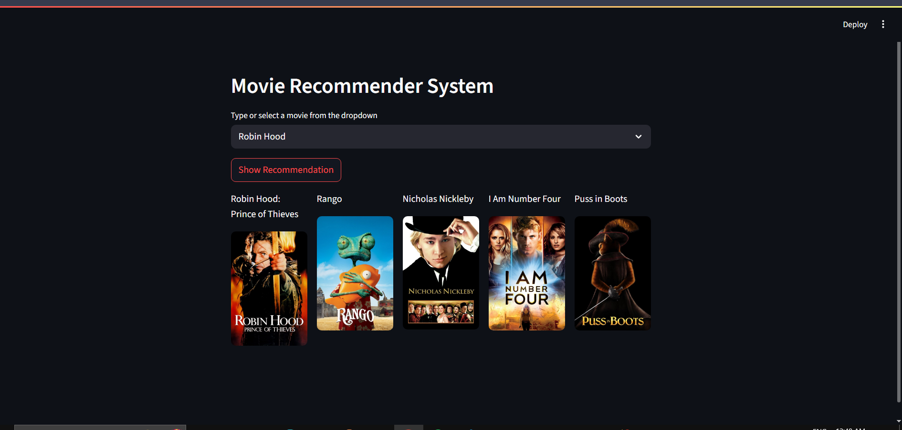

# 🎬 Movie Recommendation System

A content-based movie recommendation system built using Python, Pandas, Scikit-learn, and NLP techniques. Given a movie title, it recommends similar movies based on genres, keywords, cast, and crew.

---

## 🚀 Features

- Recommends movies based on similarity score
- Uses TF-IDF and cosine similarity for recommendations
- Parses and merges TMDB datasets (movies & credits)
- Displays movie posters fetched using TMDB API

